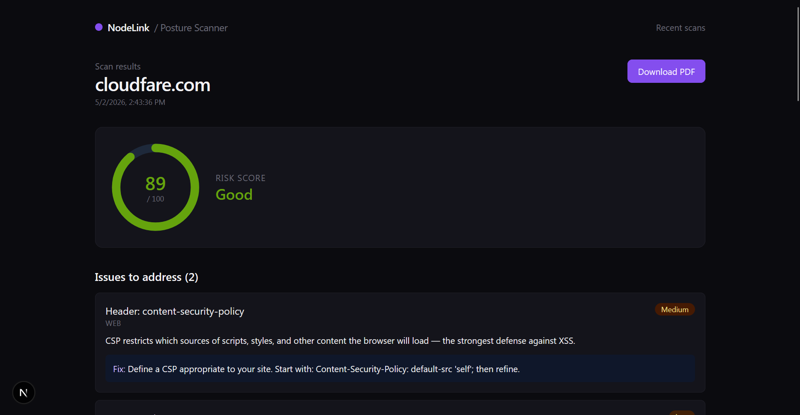
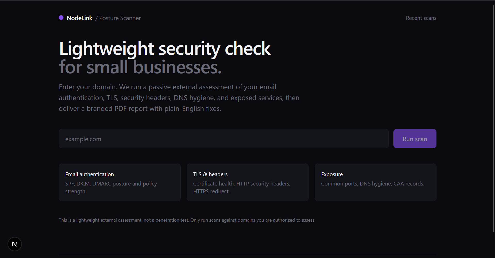
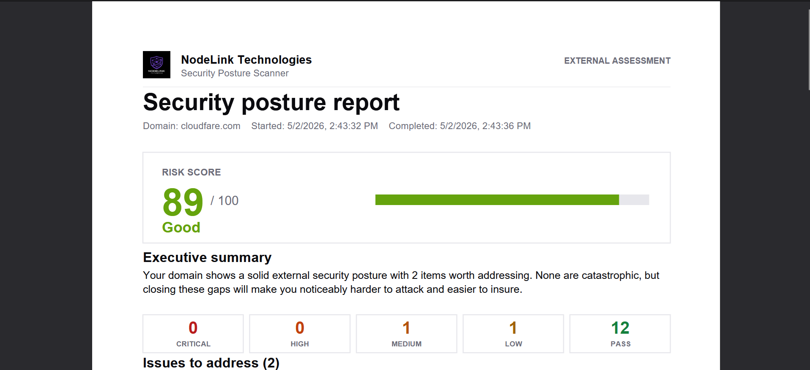

# NodeLink SMB Security Posture Scanner

> Lightweight external security assessment tool for small-business prospects. Enter a domain, get a 0-100 risk score, severity-ranked findings with plain-English remediation, and a downloadable branded PDF report.

Built as a flagship project for NodeLink Technologies LLC. Production-ready Next.js, TypeScript, and pdf-lib.



## Why this exists

Most managed service providers (MSPs) sell cloud and security services to small businesses, but small business owners struggle to understand what they actually need. This tool turns "you should improve your security" into a concrete artifact: a 0-100 score and a branded PDF the prospect can read in five minutes.

For NodeLink, this is a lead-generation tool. A prospect runs a scan, scores below 75, and now there is a specific reason to schedule a call. For a portfolio reviewer, it demonstrates real DNS, TLS, and network programming, plus product thinking about who the user is and what they need.

## Demo flow

1. Prospect enters their domain
2. Scanner runs nine passive external checks in parallel (~15-30 seconds)
3. Results page renders score, severity-sorted findings, and remediation
4. Prospect downloads a branded PDF report





## Features

- Nine passive external checks: SPF, DKIM, DMARC, MX, DNS hygiene (NS, CAA), TLS certificate health and protocol, HTTP security headers, HTTPS redirect, exposed common ports.
- Deterministic 0-100 risk score with explainable severity-based deductions.
- Plain-English remediation written for non-technical owners, not security engineers.
- Branded PDF report with logo, score card, executive summary, and per-finding fix boxes.
- Scan history dashboard.
- Per-IP rate limiting.
- SQLite for development, swap to PostgreSQL by changing one env var.

## Safety boundary

This tool performs **only passive or low-impact checks** against public infrastructure: read-only DNS lookups, TLS handshake inspection, TCP-connect probes on common ports, and HTTP fetches to read response headers. It does not exploit vulnerabilities, attempt authentication, fuzz inputs, perform SYN scans, or stress-test targets.

Use this tool only against domains you are authorized to assess (your own domain or a prospect who has consented to a self-assessment).

## Tech stack

- Next.js 15 (App Router) + TypeScript
- Tailwind CSS
- Prisma 5 + SQLite (dev) / PostgreSQL (prod)
- pdf-lib for PDF generation (no Chromium dependency)
- Zod for input validation
- LRU cache for in-memory rate limiting

## Quick start

Requires Node.js 18.17+ (20+ recommended).

```bash
npm install
cp .env.example .env
npx prisma generate
npx prisma db push
npm run dev
```

Open http://localhost:3000 and scan a domain you control or have permission to assess.

> **Windows note:** if `npx prisma db push` fails with EPERM (file in use), stop the dev server first, run the command, then restart `npm run dev`.

> **Prisma version:** the project pins Prisma 5.x. Prisma 7 changed the schema syntax and is not compatible without changes.

## Project structure

```
.
├── prisma/                 Prisma schema and dev SQLite database
├── public/                 Logo embedded into PDF
├── samples/                Example scan output JSON
├── docs/screenshots/       README screenshots
└── src/
    ├── app/                Next.js routes (pages and API)
    │   ├── api/scan/       POST /api/scan, GET /api/scan/[id], /pdf
    │   ├── scan/[id]/      Results page
    │   └── scans/          History dashboard
    ├── components/         ScanForm, ScoreGauge, FindingCard, SeverityBadge
    ├── lib/                db, validation, rate limit, logger
    ├── pdf/                pdf-lib report generator
    └── scanner/            Orchestrator + 9 check modules + scoring
```

## Scoring model
## Scoring model

Start at 100. Each failed check deducts based on severity. Passing and informational findings deduct nothing.

| Severity | Deduction |
|----------|-----------|
| Critical | 25        |
| High     | 15        |
| Medium   | 8         |
| Low      | 3         |
| Info     | 0         |

Severity is intrinsic to each check, not derived from context. This keeps scoring deterministic and explainable.

| Score  | Band       |
|--------|------------|
| 90-100 | Strong     |
| 75-89  | Good       |
| 60-74  | Needs Work |
| 40-59  | Weak       |
| 0-39   | Critical   |

## Sample scan output

See [`samples/scan-output.json`](./samples/scan-output.json) for an example of the JSON returned by `GET /api/scan/[id]`.

## Security recommendations for production deployment

The MVP is suitable for personal demos and authorized self-assessments. Before deploying for paid or multi-tenant use:

1. **Authentication.** Add NextAuth or Clerk and scope scans to the user.
2. **Stronger rate limiting.** Replace the in-memory LRU with Upstash Redis or Vercel KV so limits survive restarts and work across serverless instances. Limit by both IP and account.
3. **Domain ownership verification before automated email reports.** Require a TXT verification record before generating a branded PDF that names the requester.
4. **Background jobs.** Move scans to a queue (Inngest, BullMQ, or Vercel Cron + a polled status endpoint) for better UX and timeout safety on serverless.
5. **Outbound network egress.** Ensure your hosting provider allows outbound TCP to common ports (22, 25, 3389, etc.).
6. **Audit logging.** Expand the schema to include IP, user-agent, and authenticated user ID.
7. **Abuse prevention.** Maintain a deny-list of sensitive domains (government, banking, healthcare you do not have permission to assess).

## Roadmap

### MVP (this codebase)

- [x] Domain input + validation
- [x] Nine passive external checks
- [x] Risk scoring with explainable severity
- [x] Results page with score gauge and findings
- [x] Branded PDF report
- [x] Scan history dashboard
- [x] Per-IP rate limiting

### v1

- [ ] User accounts (NextAuth)
- [ ] Postgres in production
- [ ] Async scans with status polling
- [ ] Email delivery of PDF reports (with domain ownership verification)
- [ ] Scheduled re-scans
- [ ] Diff between scans ("3 new issues since last week")
- [ ] Logo upload per workspace (white-label for MSP partners)
- [ ] Export to CSV / JSON

### Premium

- [ ] Subdomain enumeration via certificate transparency and passive DNS
- [ ] Cloud misconfiguration hints from public metadata
- [ ] Mailbox-level DKIM/DMARC alignment with consented inbox access
- [ ] HIPAA / SOC 2 control mapping in the PDF
- [ ] Slack/Teams alerts on score drops
- [ ] API access for MSP integrations
- [ ] Vendor risk module (assess suppliers in bulk)

## License

MIT — see [LICENSE](./LICENSE).

## Disclaimer

This tool provides a lightweight external assessment based on passive checks of public domain infrastructure. It is not a penetration test, not a comprehensive security audit, and does not guarantee the absence of vulnerabilities. Findings are advisory. Use only against domains you own or have explicit authorization to assess.